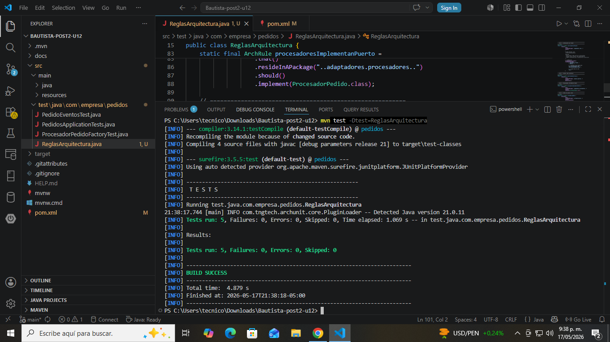
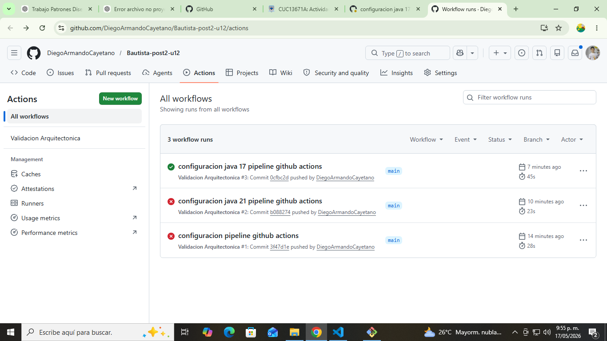
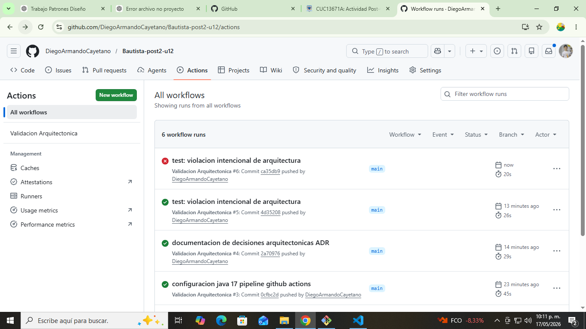

# 🏗️ Sistema de Gestión de Pedidos — Validación Arquitectónica

## Ingeniería de Sistemas — Patrones de Diseño de Software  
### Unidad 12 — Integración de Patrones y Arquitecturas  
### Post-Contenido 2 — ArchUnit + ADR + GitHub Actions  

---

# 📌 Descripción del Proyecto

Este proyecto extiende el sistema de gestión de pedidos implementado en el Post-Contenido 1, incorporando:

- Validación arquitectónica con **ArchUnit**
- Automatización CI/CD con **GitHub Actions**
- Documentación de decisiones arquitectónicas (**ADR**)
- Verificación de calidad estructural del código

El objetivo es transformar las decisiones de diseño en reglas verificables automáticamente.

---

# 🧱 Tecnologías Utilizadas

- Java 17
- Spring Boot 3
- Maven
- ArchUnit 1.2.1
- GitHub Actions
- JUnit 5

---

# 🧠 Validación Arquitectónica (ArchUnit)

Se implementaron 5 reglas arquitectónicas para garantizar el desacoplamiento del sistema:

## 🔹 Regla 1: Dominio aislado
El dominio no debe depender de infraestructura ni adaptadores.

## 🔹 Regla 2: Controladores solo usan Facade
Los controladores REST solo pueden acceder a:
- Facade
- Dominio
- Spring Web / HTTP
- Java base

## 🔹 Regla 3: Puertos como interfaces
Todos los puertos del dominio deben ser interfaces.

## 🔹 Regla 4: Procesadores implementan Strategy
Los procesadores deben implementar `ProcesadorPedido`.

## 🔹 Regla 5: Infraestructura no accede a REST
La capa de infraestructura no puede depender de controladores REST.

---

# 🧪 Evidencia de Ejecución ArchUnit

## ✅ Pruebas ejecutadas correctamente



---

# ⚙️ Integración CI/CD con GitHub Actions

Se configuró un pipeline que ejecuta automáticamente:

- Validación ArchUnit
- Pruebas unitarias
- Verificación Maven

---

## 🟢 Pipeline exitoso



---

## 🔴 Pipeline con violación arquitectónica

Se ejecutó una violación intencional para validar el sistema de control arquitectónico.



---

# 📚 Decisiones Arquitectónicas (ADR)

Se documentaron 3 decisiones clave:

## 📄 ADR-001 — Arquitectura Hexagonal
Ubicación: `docs/adr/ADR-001.md`

## 📄 ADR-002 — Strategy + Factory
Ubicación: `docs/adr/ADR-002.md`

## 📄 ADR-003 — Observer con Spring Events
Ubicación: `docs/adr/ADR-003.md`

---

# 🔄 Flujo del Sistema

1. Cliente envía petición REST
2. Controlador delega a la Facade
3. Facade selecciona Strategy (Factory)
4. Se procesa el pedido
5. Se guarda en base de datos
6. Se publica evento (Observer)
7. Los listeners reaccionan

---

# 📊 Resultado de Calidad

## Antes
- Arquitectura acoplada
- Dependencias directas entre capas
- Sin validación estructural

## Después
- Arquitectura desacoplada
- Reglas automáticas con ArchUnit
- CI/CD con validación continua
- ADR como documentación viva

---

# 📸 Evidencias del Proyecto

## 🧪 ArchUnit ejecutado correctamente


---

## 🟢 Pipeline exitoso


---

## 🔴 Pipeline con violación detectada


---

# ⚙️ Comandos del Proyecto

## Ejecutar pruebas ArchUnit
```bash
mvn test -Dtest=ReglasArquitectura
```

## Ejecutar pruebas completas
```bash
mvn clean verify
```

## Ejecutar aplicación
```bash
mvn spring-boot:run
```

---

# 🧾 Conclusión

Este proyecto demuestra:

- Aplicación de arquitectura hexagonal
- Uso de patrones de diseño (Strategy, Factory, Observer, Facade)
- Validación automática de arquitectura con ArchUnit
- Integración CI/CD con GitHub Actions
- Documentación formal con ADR

---

# 👨‍💻 Autor

**Diego Armando Cayetano**  
Ingeniería de Sistemas — 2026
